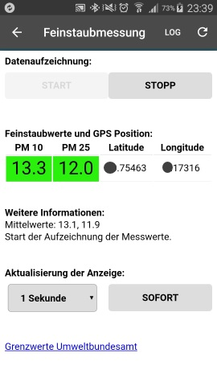

# Mobiler Feinstaubsensor - Raspberry Pi (Software)
Hier finden Sie das Python Programm fuer den Nachbau des Feinstaubsensors auf Basis eines Raspberry Pi, SDS011 Feinstaubsensors und einem GPS Empfaengers wie in der [C't 1/2018](https://www.heise.de/ct/ausgabe/2018-1-Feinstaub-unterwegs-messen-und-mit-GPS-Daten-aufzeichnen-3919188.html) beschrieben. 
Die Bedienung des Feinstaubsensors erfolgt ueber eine Web-Oberflaeche die durch den Flask Web-Server bereitgestellt wird.

### Hinweis
Inzwischen wurde das Programm auch fuer die Android-Plattform durch den User "optiprime" portiert. Weitere Details dazu sind im Abschnitt **"Mobiler Feinstaubsensor - Android-Variante"** weiter unter aufgeführt. Mein Dank für diese Portierung geht an den GitHub User "optiprime"!

## Komponentenliste
Die Liste der Komponenten die Sie benoetigen um den mobilen Feinstaubsensor selber bauen zu koennen finden Sie auf meinem Blog: [www.byteyourlife.com](https://www.byteyourlife.com/haushaltsgeraete/feinstaubsensor-komponentenliste/7369)

## Version 0.1
Die erste Version der mobilen Variante des Feinstaubsensors sah bei mir wie auf dem folgenden Bild gezeigt aus.

## Version 1.0
Die aktuelle Version des mobilen Feinstaubsensor sieht wie auf dem nachfolgenden Bild gezeigt aus.


## BME280 Sensor - fuer Luftdruck, Luffeuchte und Temperatur
In den Feinstaubsensor wurde noch ein Adafruit [BME280 Sensor](https://www.adafruit.com/product/2652) fuer Luftdruck, Luftfeuchte und Temperatur integriert. Die Programme wurden entsprechend angepasst. Damit der BME280 Sensor angesprochen wird und die Messwerte in die CSV Datei geschreiben werden muss das Programm "web_feinstaub_bme280.py" und die HTML Datei "index_bme280.html" verwendet werden. Entsprechend muss die Start Datei "feinstaub_start.sh" angepasst werden damit das Programm "web_feinstaub_bme280.py" automatisch nach dem Einschalten des Raspberry Pi gestartet wird.


## Wunschliste
Die Wunschliste listet die Funktionen auf die ich noch gerne in das Projekt integrieren möchte.

### Flask-SocketIO asynchrones Updates
Aktuell aktualisiert die Web-Overflaeche nur die gemessenen Werte wenn expliziet das refresh Button gedrueckt wird. Aber viel bessere waere es wenn die Werte in einem frei definierbaren Intervall aktualisiert werden also z. B. jede Sekunde.

### Sleep / Measure Mode fuer den SDS011 Sensor
Ich würde sehr gerne eine Funktion in mein Programm integrieren die den SDS011 Sensor auch in den Sleep Mode versetzt wenn keine Messung erfolgen soll. Auch wäre es so möglich abhängig von der Geschwindigkeit den Messintervall des SDS011 einzustellen. Den Hinweis dazu habe ich von dem GitHub User [luetzel](https://github.com/luetzel) erhalten.
Ich habe mir das folgende Projekt jetzt genauer angeschaut und werde wohl auf diesem Code aufsetzen.
[Frank Heuer SDS011 Python](https://gitlab.com/frankrich/sds011_particle_sensor)

# Mobiler Feinstaubsensor - Android-Variante mit HC-06 Bluetooth Adapter
Da fast alle Android-Handys über einen leistungsfähigen Prozessor, GPS und Bluetooth verfügen, kommt man bei dieser Lösung auch ohne Raspberry-Pi und die externe GPS-Maus aus. Das Python-Programm läuft dann unter Android und die Verbindung zum Feinstaubsensor SDS011 erfolgt über Bluetooth. Prinzipiell wäre auch der Betrieb auf iPhone möglich, wurde aber im Testaufbau mangels Geräteverfügbarkeit nicht weiter verfolgt.

## Benötigte Komponenten
Neben dem Android-Handy werden weitere Teile benötigt:
- Feinstaubsensor SDS011 und Schlauchstück (siehe oben)
- Bluetooth-Wireless-Modul HC-06 oder HC-05 (Kosten: ca. 4€ - 13€, [Amazon](https://www.amazon.de/dp/B01FCQZ8VW/ref=psdc_1626220031_t2_B0722MD4FY), [Aliexpress](https://de.aliexpress.com/item/2pcs-lot-HC-06-Bluetooth-for-arduino-serial-pass-through-module-wireless-serial-communication-HC06-Bluetooth/32263209772.html), ...)
- Powerbank (siehe oben)
- Altes USB-Kabel zum Anschluss an Powerbank (z.B. von ausrangierter Computermaus oder Tastatur, o.ä.)
- Software: QPython-App (kostenlos)

## Anschluss der Komponenten
Die Hardware-Komponenten werden wie folgt verkabelt:


Ähnlich wie in der Raspberry-Variante werden sie in eine passende Box gepackt und mit der Powerbank verbunden.

## Software-Installation und -Konfiguration
[QPython](https://play.google.com/store/apps/details?id=org.qpython.qpy&hl=de) lässt sich kostenlos über den Google Playstore installieren. Bitte nicht QPython3 verwenden, das unsere Code nicht kompatibel mit Python 3.X ist. Nach Start der App ist zunächst das Python-Modul *flask* zu installieren. Hierzu zunächst auf den oberen Button mit dem gelben Quadrat  drücken und im Folgedialog *pip_console.py" auswählen. In dem sich dann öffnenden Terminal-Fenster das Kommando

```
pip install flask
```

eingeben. Nach erfolgreicher Installation kann man mit dem Zurück-Befehl ins Hauptmenü zurückkehren. Die Nachfrage, ob das Programm im Hintergrund weiterlaufen soll, ist zu verneinen.

Im nächsten Schritt legt man eine Kopie der Datei `web_feinstaub.py` mit Namen `main.py` an. Das vereinfacht auch den späteren Start des Programms auf dem Handy. In den ersten paar Zeilen von `main.py` (Konfigurationsblock) tragen wir die Bluetooth-Adresse des HC-06/HC-05 Moduls ein:

```
# Bluetooth MAC-Addresse des HC05/HC06-Moduls, welcher die Verbindung zum
# SDS011-Sensor herstellt.
sds011_bluetooth_device_id = '20:14:08:13:25:28'
```

Wer die Adresse nicht kennt, kann sie nach Pairing (PIN 1234 oder 0000) des Android-Handys mit dem HC-06/HC-05 z.B. mittels der App [Bluetooth Terminal HC-05](https://play.google.com/store/apps/details?id=project.bluetoothterminal) einfach bestimmen. Mit dieser App lässt sich auch die Bluetooth-Übertragung der Feinstaubwerte überprüfen. Da es sich hierbei um Binärdaten handelt, bitte die Darstellung von ASCII auf HEX umstellen.

Nun kopiert man das komplette Programmverzeichnis `Feinstaubsensor` inklusive aller Unterverzeichnisse auf das Handy in den *Internen Speicher* und dort in das  Unterverzeichnis `qpython\projects`. Das geht besonders einfach, wenn man das das Handy über den USB mit dem PC verbindet.

## Programmstart und -terminierung
Drückt man nun im Hauptmenü von QPython wieder auf das gelbe Quadrat, so erscheint jetzt auch *Feinstabsensor* in der Programmübersicht. Das Programm läßt sich mit einem Klick starten. Erscheint die schon in der Raspberry-Variante beschriebene Bedienoberfläche:



Das Programm läuft problemlos im Hintergrund weiter und speichert Messdaten, selbst wenn man das Handy für andere Zwecke nutzt. Über die für die für das jeweilige Androidsystem typischen Gesten kann man das Programm durch Termierung der QPython-App beenden.

## Datenauswertung
Die Messdaten werden im Unterverzeichnis `Feinstaubsensor` im *Internen Speicher* des Handys gespeichert. Schließt man sein Handy wieder über den USB an den PC an, so lassen sich die Daten sehr einfach übertragen bzw. sofort in Google Earth öffnen.

## SDS011-Mock
Das Projekt hat mich so faziniert, dass ich die Android-Portierung bereits vor der Lieferung des SDS011 Sensors umgesetzt habe. Damit ich dennoch das Zusammenspiel der Komponenten testen konnte, habe ich einen *Mock*, d.h. eine Ersatzkomponente für den Sensor gebaut, die schnittstellenkompatibel ist. Hierzu habe ich einen Arduino Nano verwendet, dessen serielles Interface ich mit dem HC-06 verbunden habe. Das passende Arduino-Programm ist im Verzeichnis [SDS011_Mock](SDS011_Mock/SDS011_Mock.ino) abgelegt.

Aktuell aktualisiert die Web-Overflaeche nur die gemessenen Werte wenn expliziet das refresh Button gedrueckt wird. Aber viel bessere waere es wenn die Werte in einem frei definierbaren Intervall aktualisiert werden also z. B. jede Sekunge.

# Mobiler Feinstaubsensor - Android-Variante mit USB Adapter
Eine Idee auf die mich Sebastian Müller brachte ist eine Android Variante nur mit einem USB Adapter zu bauen. Noch fehlt mir das Wissen die Programmierung auf Basis der durch "optiprime" entwickelten Android Variante vorzunehmen. Hier ist schon mal die notwendige Hardware zu sehen.
https://www.byteyourlife.com/wp-content/uploads/2018/01/Feinstaubsensor_Android_Smartphone-300x200.jpg
